# 🚀 Projeto WordPress com Docker, RDS, EFS, Load Balancer e Auto Scaling na AWS

Este projeto tem como objetivo provisionar uma infraestrutura escalável e resiliente para o WordPress, utilizando serviços gerenciados da AWS em conjunto com containers Docker e orquestração via Docker Compose.

---
## 📑 Sumário
  - [🖥️ Etapas no Console da AWS](#️-etapas-no-console-da-aws)
    - [1. Criar a VPC](#1-criar-a-vpc)
    - [2. Criar um EFS](#2-criar-um-efs)
    - [3. Criar o RDS (MySQL)](#3-criar-o-rds-mysql)
    - [4. Criar EC2](#4-criar-ec2)
    - [5. Acessar instância pelo terminal](#5-acessar-instância-pelo-terminal)
    - [6. Configurar Security Groups](#6-configurar-security-groups)
    - [7. Configurar Wordpress](#7-configurar-wordpress)
    - [8. Criar Target Group](#8-criar-target-group)
    - [9. Criar um Load Balancer](#9-criar-um-load-balancer)
    - [10. Criar Launch Template](#10-criar-launch-template)
    - [11. Criar Auto Scaling Group](#11-criar-auto-scaling-group)
    - [12. Alterar Security Group da EC2](#12-alterar-security-group-da-ec2)
  - [💻 Testes finais](#-testes-finais)
    - [1. Entrar na instância através do DNS do Load Balancer](#1-entrar-na-instância-através-do-dns-do-load-balancer)
  - [✅ Conclusão](#-conclusão)

---
## 🖥️ Etapas no Console da AWS

### 1. Criar a VPC

 - Na barra de pesquisa, procurar por VPC

 - Clique em "Create VPC":  
    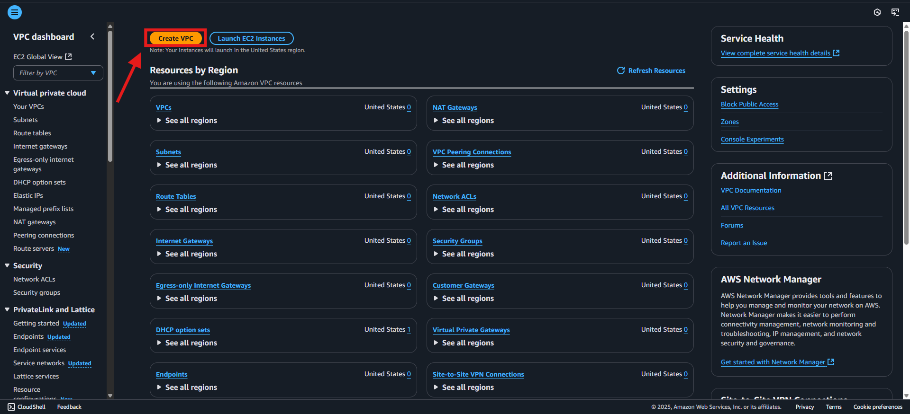 

 - Na criação da VPC, selecione "VPC and more" e digite um nome para esta VPC:  
    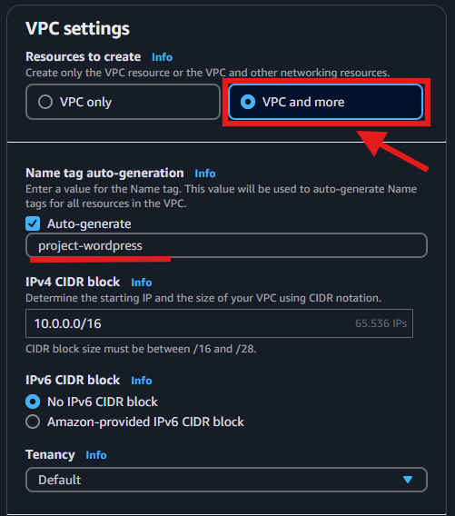  

> [!NOTE]\
> "VPC and more" cria automáticamente 2 sudnets públicas e 2 privadas, 1 route table para as subnets públicas e 1 route table para cada subnet privada (3 route tables ao total) e por fim, cria as 2 conexões "Network connections": 1 Internet Gateway para a route table pública e 1 para o S3 Gateway.

 - Na parte "NAT gateways" e "VPC endpoints" selecionar como na imagem:  
    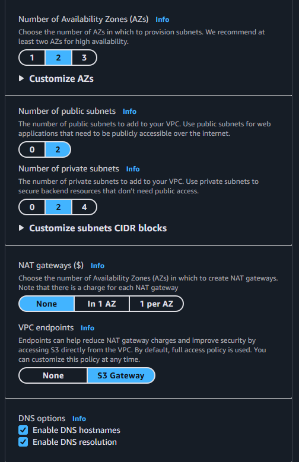

> [!NOTE]\
> As outras partes já virão selecionadas por padrão, mas certifique-se de que estejam como na imagem.

 - Ao final da página clique em "Create VPC".

 - O Resource Map será parecido com este:  
    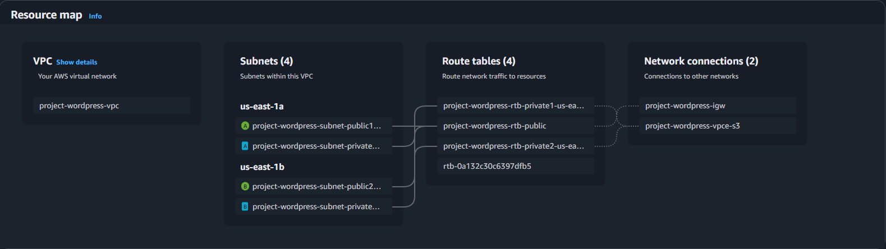

### 2. Criar um EFS

- Na barra de pesquisa, procure por "EFS"

- Clique em "Create file system"

- Adicione um nome, escolha a VPC que criamos préviamente e clique em "Create file system":  
    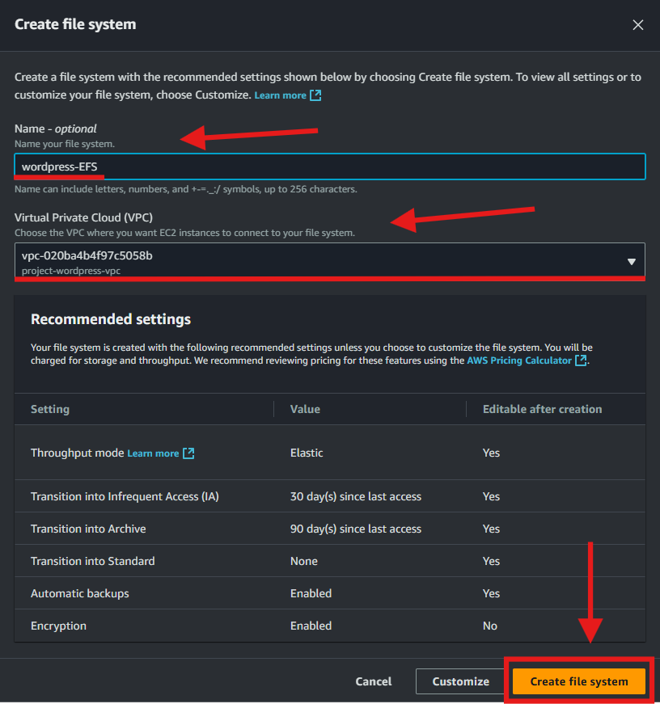  

- Criar pontos de montagem para as sub-redes públicas
- Adicionar regras no SG para permitir NFS (porta 2049)

### 3. Criar o RDS (MySQL)

- Na barra de pesquisa, procure por "RDS"

- No menu lateral, clique em "Databases" e então em "Create database":  
    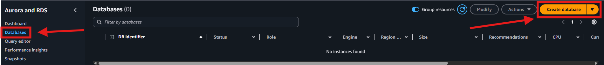  

- Em "Engine options" selecione "MySQL":  
    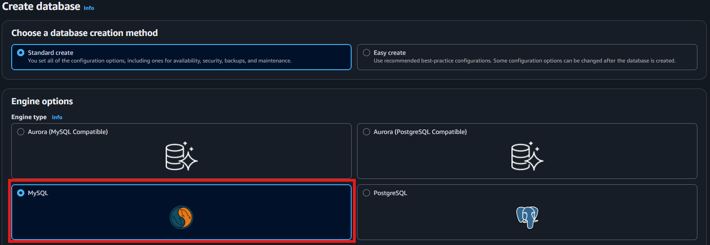  

- Na parte "Templates" selecione a opção "Free tier":  
    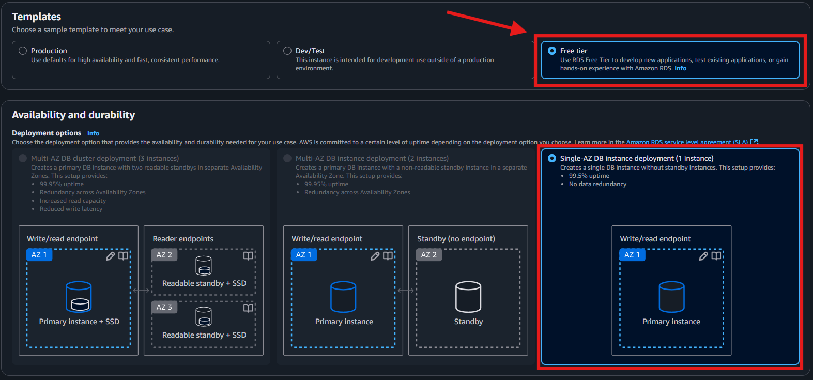  

> [!NOTE]\
> A opção "Availability and durability" terá apenas uma opção possível disponível para free tier, sendo a opção "Single-AZ DB instance deployment"

- Em "Settings" renomeie o id do banco de dados e digite a senha desejada para este banco:  
    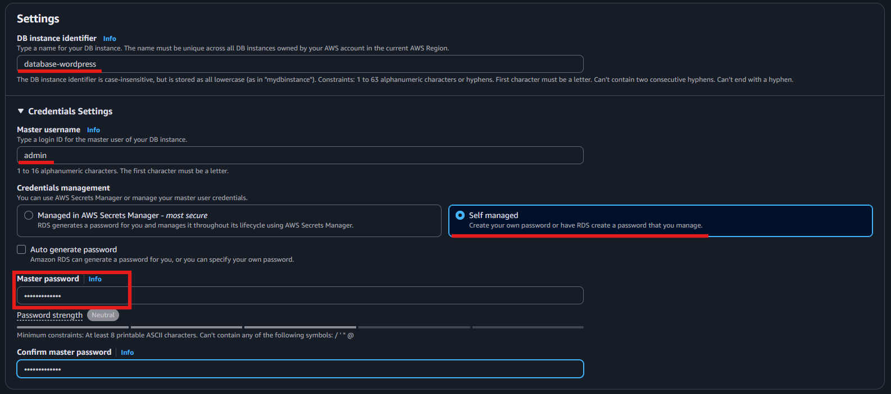  

> [!NOTE]\
> Por padrão, o username do banco de dados já vem como "admin", mas pode ser alterado caso desejado.

- Na parte seguinte "Instance configuration", deixe a última opção como "db.t3.micro":  
    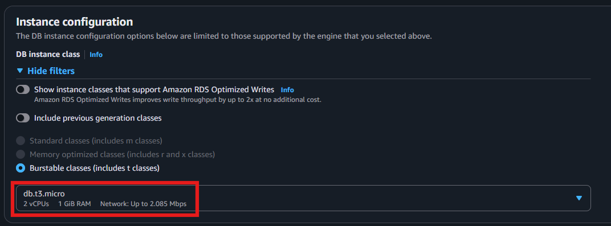  

- Em "Storage" e "Connectivity" todas as opções são préviamente selecionadas por padrão, mas certifique-se de que estejam marcadas desta forma:  
    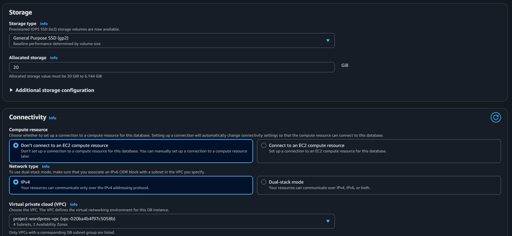
    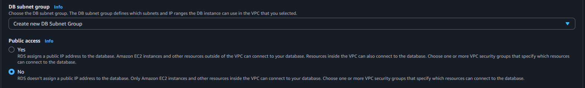  

- Ainda em "Connectivity" selecione a opção "Create new" para criar um novo security group para este RDS e digite o nome desejado:  
     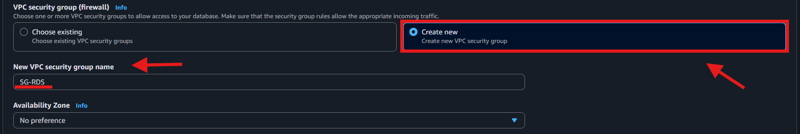  

- As opções seguintes deixe como vêm por padrão:  
    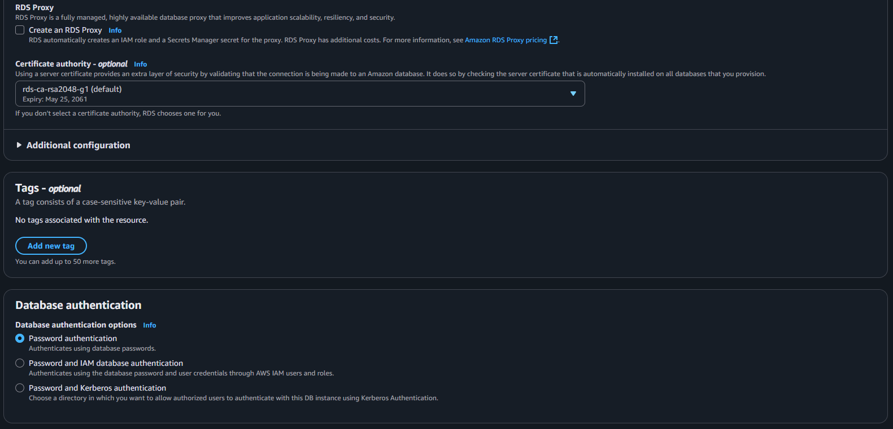  
    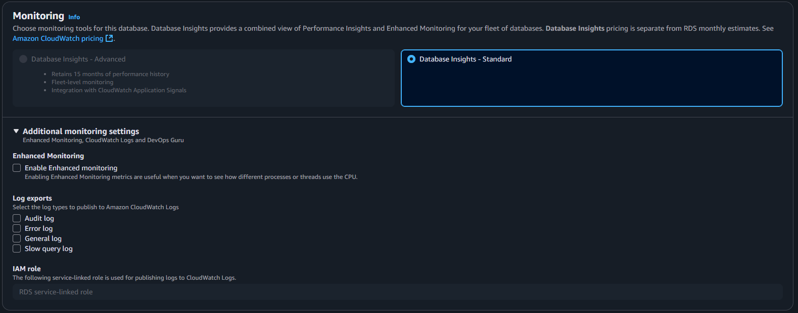  

- Em "Additional configuration" digite o nome para o banco de dados:  
    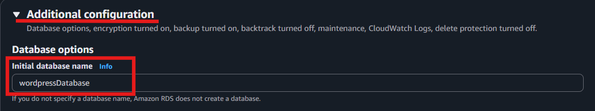  

> [!WARNING]\
> Caso não adicione este nome, o banco não será criado automáticamente.

- As opções seguintes deixe como vêm por padrão:  
    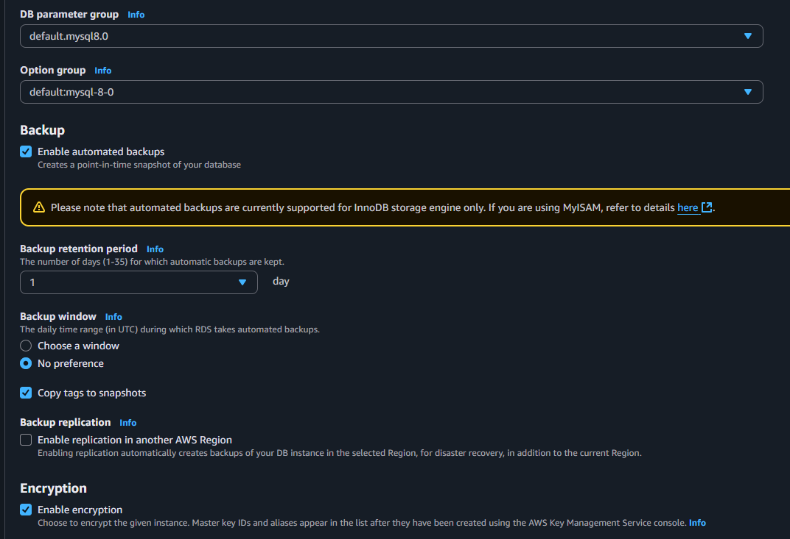  
    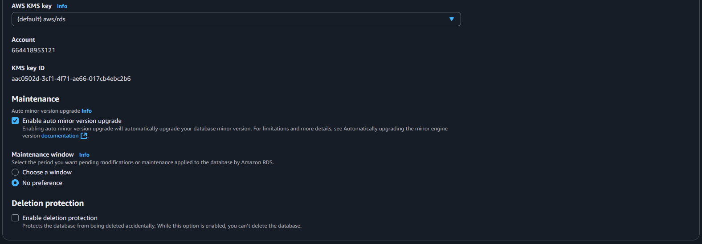  

- Por fim, clique em "Create database".

### 4. Criar EC2

> [!NOTE]\
> Essa EC2 será utilizada para configurar o Wordpress pela primeira vez e para os testes de persistência de dados.

- Na barra de pesquisa, procure por EC2 e clique em "Launch instance":  
  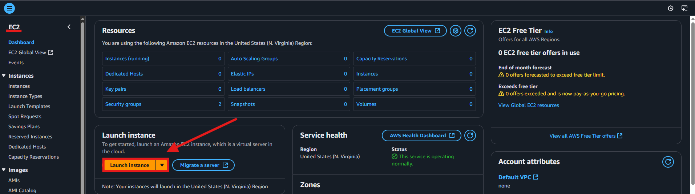

- Adicione as tags necessárias e selecione a imagem Ubuntu:  
  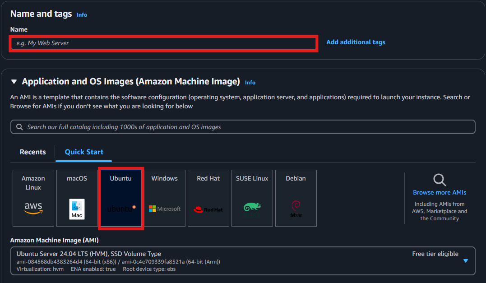

- Em "Instance type" selecione o tipo "t2.micro" e em "Key pair" selecione "Create new key pair":  
  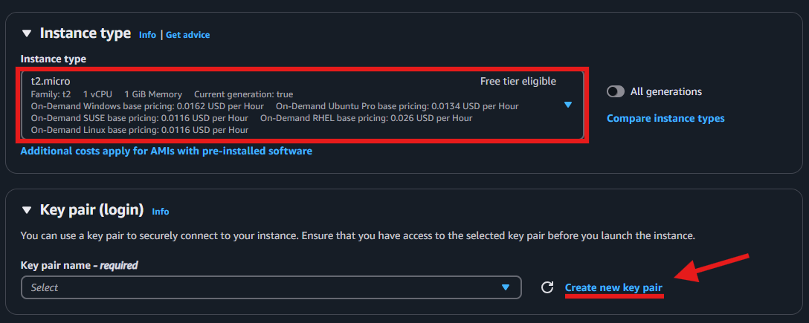

> [!NOTE]\
> Este tipo de instância faz parte do free tier da AWS.

- Em "Create key pair" nomeie a chave, mantenha as outras configurações e clique em "Create key pair":  
  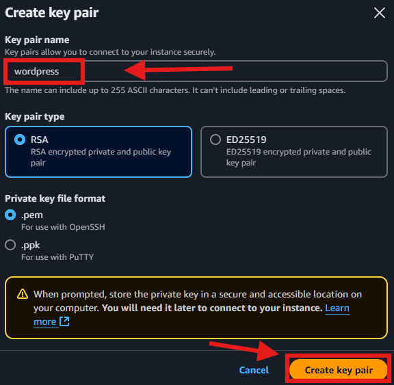

> [!NOTE]\
>Após criar a chave, o download dela se iniciará na sua máquina na pasta downloads.

- Em "Network settings" tenha certeza de que a VPC correta está selecionada e que a subnet seleciona seja uma pública. Mantenha o "Auto-assign public IP" como "Enable", selecione "Create security group e nomeie este novo grupo:  
  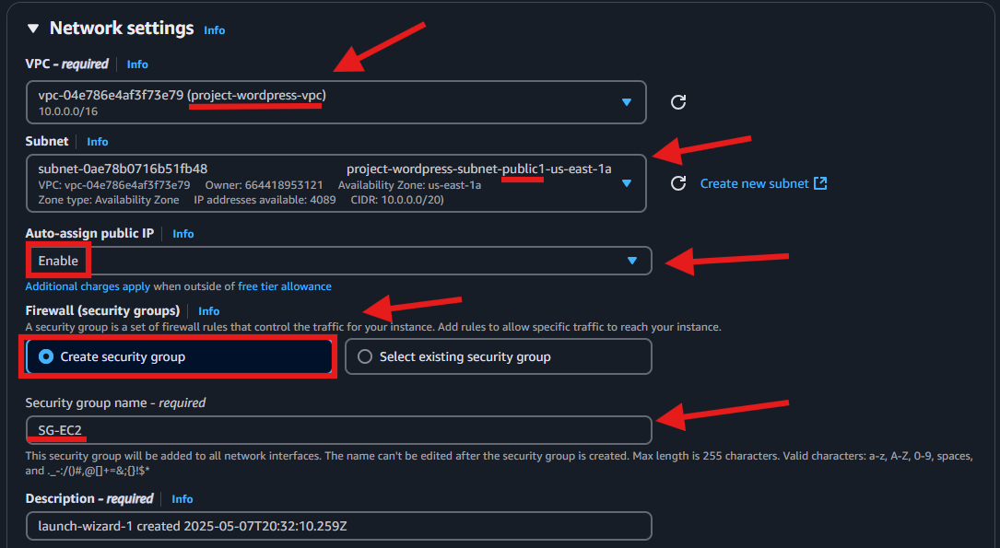

- Em seguida apenas mude o "Source type" em "Inbound Security Group Rules" para "My IP":  
  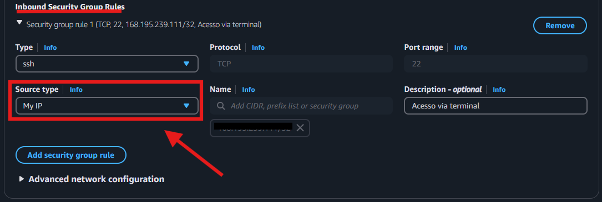

> [!NOTE]\
> Ao lado em "Name" seu IP aparecerá. Borrei o meu por questões de segurança.

- "Configure storage" mantenha como já vem por padrão

- Em "Advanced details", mude apenas esta função para "Enable":  
  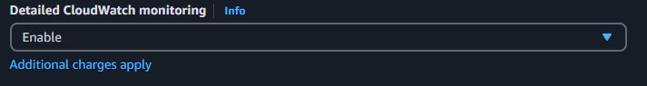

- Ao final adicione seu "user_data":  
  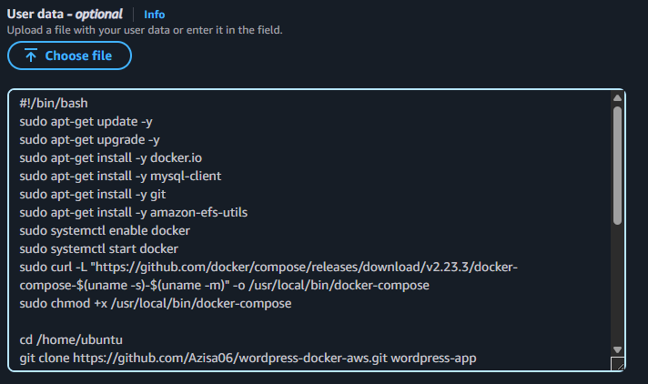

- Este é o user_data que usei:
  ```bash
  #!/bin/bash
  sudo apt-get update -y
  sudo apt-get upgrade -y
  sudo apt-get install -y docker.io
  sudo apt-get install -y mysql-client
  sudo apt-get install -y git 
  sudo apt-get install -y amazon-efs-utils

  sudo systemctl enable docker
  sudo systemctl start docker

  # Instala Docker Compose
  sudo curl -L "https://github.com/docker/compose/releases/download/v2.23.3/docker-compose-$(uname -s)-$(uname -m)" -o /usr/local/bin/docker-compose
  sudo chmod +x /usr/local/bin/docker-compose

  # Clona o repositório (substitua pela URL do seu repositório GitHub)
  cd /home/ubuntu
  git clone https://github.com/SEU_USUARIO/wordpress-docker-aws.git wordpress-app
  cd wordpress-app

  # Monta o EFS (substitua fs-xxxxxxxxxxxxxxxxx pelo ID do seu EFS)
  sudo mkdir -p /mnt/efs
  sudo mount -t efs -o tls fs-xxxxxxxxxxxxxxxxx:/ /mnt/efs
  sudo chown -R 33:33 /mnt/efs

  # Aguarda o Docker iniciar totalmente
  until sudo docker info > /dev/null 2>&1; do
      echo "Aguardando o Docker iniciar..."
      sleep 3
  done

  # Inicia os containers
  sudo docker-compose up -d

  # Criação de banco (substitua o endpoint do rds, usuário e senha pelas variáveis que foram configuradas na AWS)
  mysql -h SEU_ENDPOINT_RDS -u USUARIO -pSENHA -e "CREATE DATABASE IF NOT EXISTS wordpress_db;"

  echo "Instância pronta. Containers iniciados com sucesso."

  ```

- Lembre-se de também configurar um docker-compose.yml:
  ```bash
  version: '3.8'

  services:

    wordpress:
      image: wordpress
      restart: always
      ports:
        - 80:80
      environment:
        WORDPRESS_DB_HOST: SEU_ENDPOINT_RDS
        WORDPRESS_DB_USER: USUARIO
        WORDPRESS_DB_PASSWORD: SENHA
        WORDPRESS_DB_NAME: NOMEBANCO
      volumes:
        - /mnt/efs:/var/www/html/wp-content
  ```

> [!NOTE]\
> Este [user_data](./user_data.sh) e [docker-compose](./docker-compose.yml) também se encontram nas pastas deste repositório.

- Espere a instância ficar com este status para prosseguir:  
  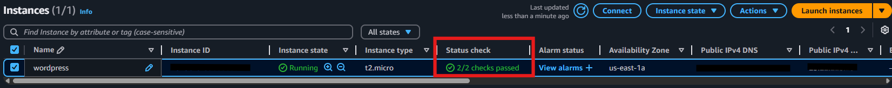

### 5. Acessar instância pelo terminal

> [!NOTE]\
> Estou usando um terminal WSL Ubuntu, visto que meu sistema operacional é windows, mas pode ser qualquer terminal Ubuntu.

- Se estiver usando WSL, acesse sua chave através deste caminho:
  ```bash
  cd /mnt/c/users/SeuUserWindows/downloads
  ```

- Dê a permissão correta para sua chave com este comando:
  ```bash
  chmod 400 NomeDaChave.pem
  ```

- E então poderá acessar sua instância por este comando:
  ```bash
  ssh -i NomeDaChave.pem ubuntu@IpPublicoDaIntancia
  ```

> [!NOTE]\
> O IP público da instância, você encontra aqui:  
> 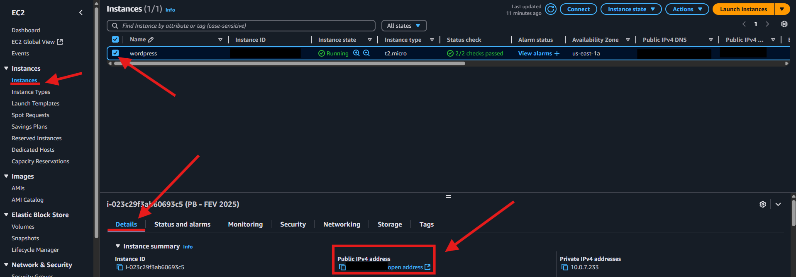

- Dentro da instância, faça estes testes para saber se tdo foi instalado corretamente:
  ```bash
  docker --version
  docker-compose --version
  ```
  - Estas repostas ou parecidas devem aparecer:
    ```bash
    Docker version 26.1.3, build 26.1.3-0ubuntu1~24.04.1
    Docker Compose version v2.23.3
    ```

### 6. Configurar Security Groups

- No menu lateral, procure por "Security Groups" e clique em "Create security group":  
  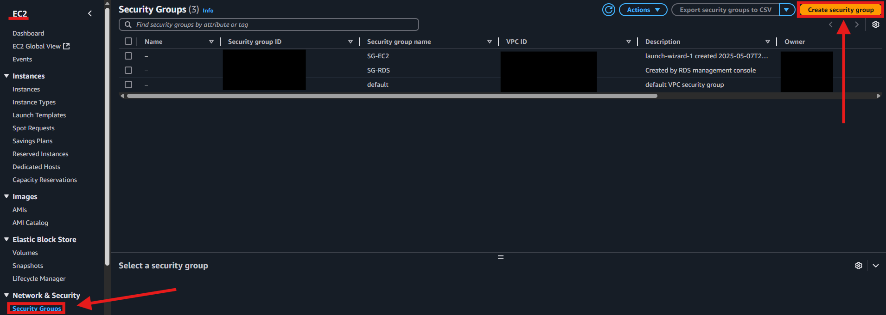

- Nomeie este grupo, adicione uma descrição e selecione a VPC:  
  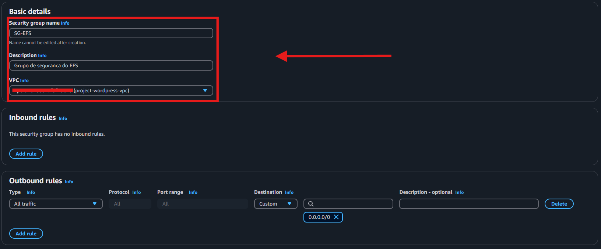

> [!NOTE]\
> Por enquanto vamos manter as regras como estão.

- Ao final da página clique em "Create security group".

- Volte a página dos security groups, clique com o botão direito do mouse sob o grupo da EC2 e clique em "Edit inbond rules":  
  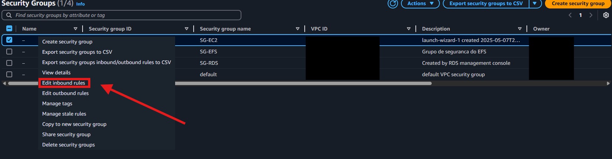

- Adicione estas regras e salve:  
  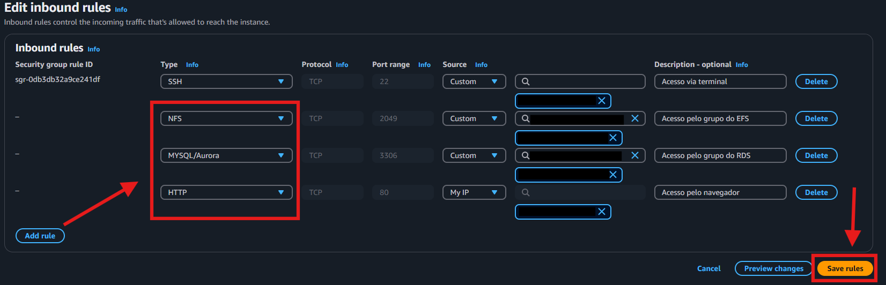

> [!NOTE]\
> Na regra NFS, em "Source" selecione o security group do EFS;
> Na regra MYSQL/Aurora, em "Source" selecione o security group do RDS;
> Na regra HTTP, em "Source" selecione o seu IP.

- Faça o mesmo no grupo do RDS e edite as inbound rules, adicionando estas regras e salve:  
  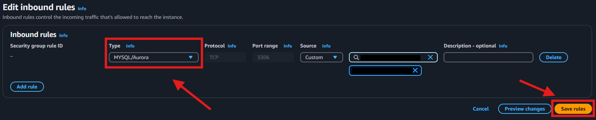

> [!NOTE]\
> Em "Source" selecione o security group da EC2.

- Delete todas as outbound rules do grupo de segurança do RDS

- Edite também as inbound rules do EFS:  
  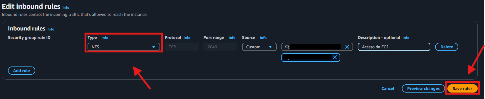

> [!NOTE]\
> Em "Source" selecione o security group da EC2.

### 7. Configurar Wordpress

- Acesse no navegador: http://IpPublicoDaInstancia:80

- Se tudo estiver certo, você verá essa tela:  
  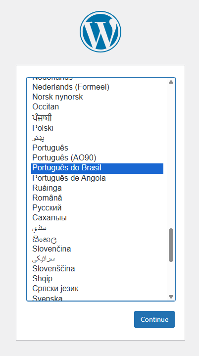

- Selecione o idioma desejado

- Em seguida configure como quiser:  
  

- Dentro do Wordpress, adicione algumas imagens para testar a persistência dos dados:  
  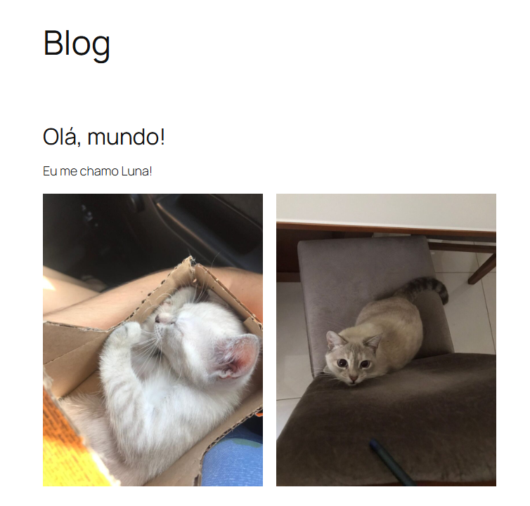

### 8. Criar Target Group

- Na barra de pesquisa, procure por EC2

- No menu lateral, clique em "Target Groups" e depois em "Create target group":  
  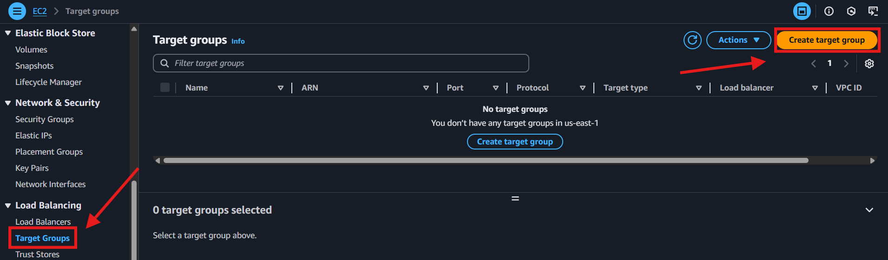

- Selecione a primeira opção e nomeie o target group:  
  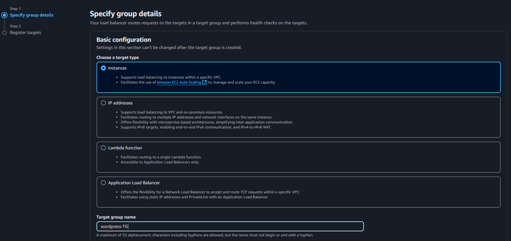

- Selecione a VPC e restante das seleções ficam como o padrão:   
  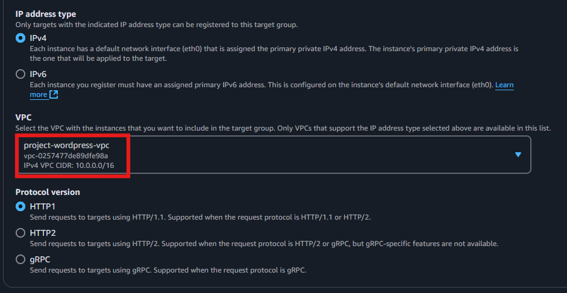

- "Health checks" deixe também como o padrão:  
  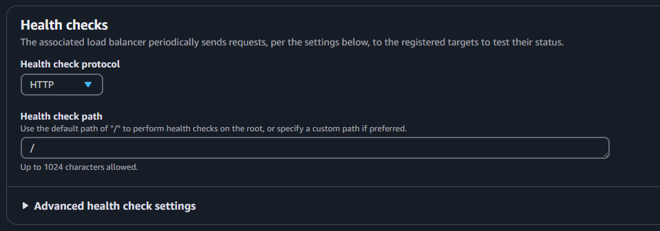

- Ao fim da página, clique em "Next"

- Selecione a EC2 existente e clique em "Include as pending below":
  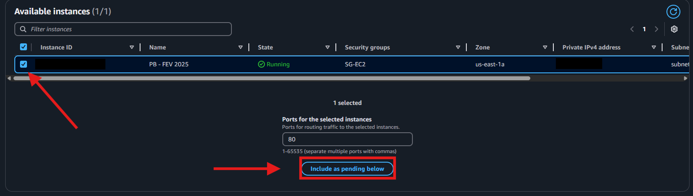

- No final da página, clique em "Create target group" e você verá esta imagem:  
  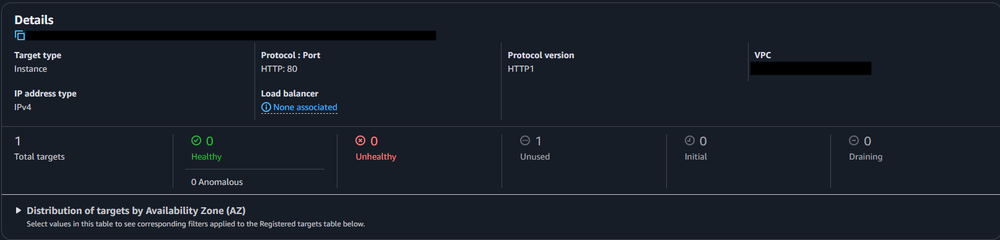

### 9. Criar um Load Balancer

- Ainda na mesma página do target group, no menu lateral clique em "Load Balancers" e então em "Create load balancer":  
  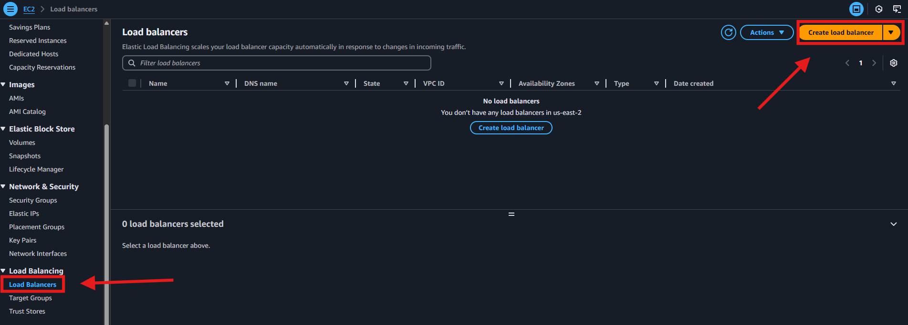

- Selecione a primeira opção:  
  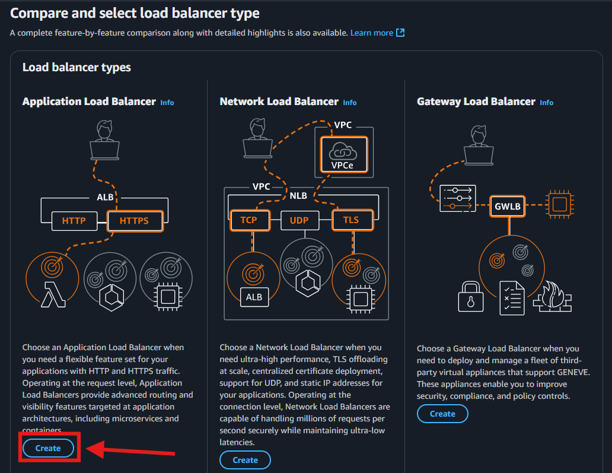

- Nomeie o load balancer e deixe como "Internet-facing":  
  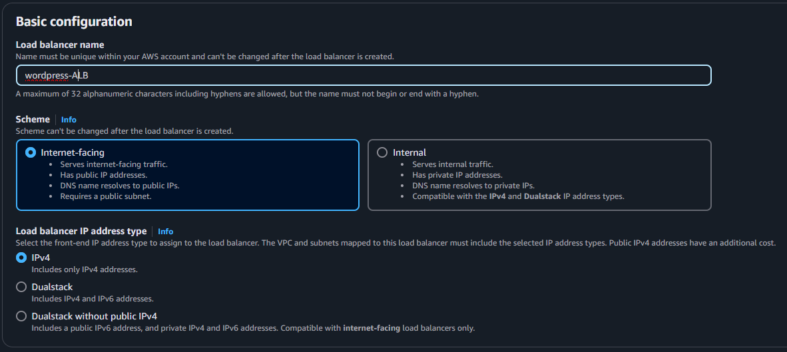

- Selecione a VPC e as duas subnets públicas:
  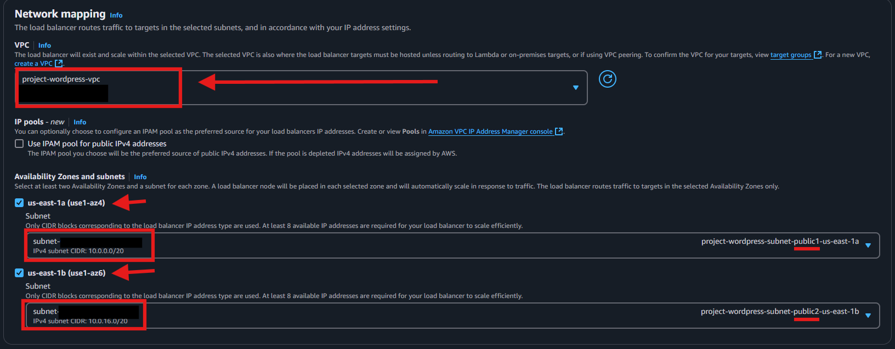

- Na próxima parte, clique em "Create a new security group":
  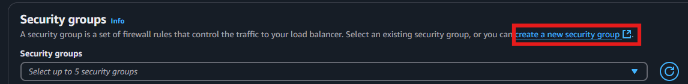

- Na criação deste Security group, adicione o nome, descrição, VPC e as seguintes inbound e outbound rules:  
  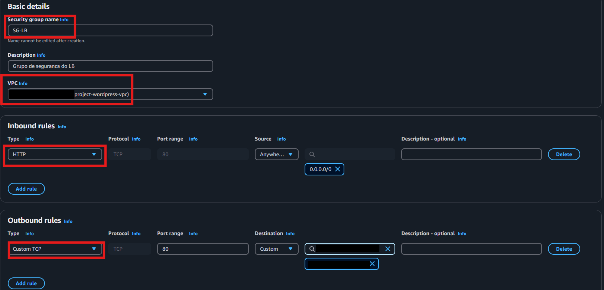

> [!NOTE]\
> Em "Source" do outbound rule selecione o security group da EC2. 

- Volte à guia anterior e selecione o grupo do Load Balancer que acabamos de criar:  
  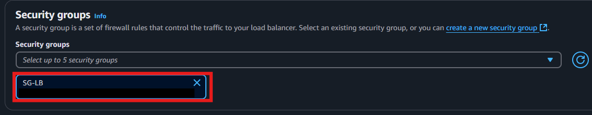

- Em "Listeners and routing" selecione o target group que criamos préviamente:  
  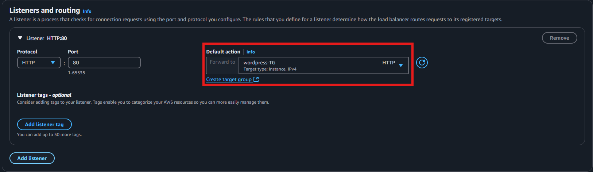

- E por fim, ao final da página clique em "Create load balancer"

### 10. Criar Launch Template

- No menu lateral, clique em "Launch Templates" e depois em "Create launch template":  
  

- Digite o nome e descrição para este template e selecione esta opção:  
  

- Selecione a imagem Ubuntu:  
  

- Selecione o tipo da instância e a key pair:  
  

- Selecione o security group da EC2:  
  

- Adicione as Tags necessárias:  
  

- Em "Advanced details" deixe apenas esta opção como "Enable":  
  

- Ao final, adicione o user_data, assim como adicionamos na EC2:  
  

- Clique em "Create launch template"

### 11. Criar Auto Scaling Group

- Em EC2, no menu lateral procure por "Auto Scaling Groups" e em "Create Auto Scaling group":  
  

- Digite o nome e selecione o launch template que acabamos de criar:  
  

- Ao final da página clique em "Next"

- Na próxima página, selecione a VPC e as subnets públicas e clique em "Next":  
  

- Na próxima página, deixe marcado estas opções e selecione o load balancer que criamos:  
  

- No final da página, marque esta opção e clique em "Next":  
  

- Na próxima página deixe desta forma:  
  

- Ao final desta página, marque estas opções e clique em "Next":
  

- Na página "Add notifications" apenas clique em "Next"

- Na página de tags, adicione todas necessárias:
  

- Na última página, revise tudo e então clique em "Create Auto Scaling group"

- Volte à página das Instâncias e verá a nova instância criada pelo auto scaling:  
  

### 12. Alterar Security Group da EC2

- Edite a inbound rule da EC2, adicionando esta regra:
  

> [!NOTE]\
> Em "Source" selecione o security group da EC2.

## 💻 Testes finais

### 1. Entrar na instância através do DNS do Load Balancer

- Copie o DNS do Load Balancer e cole no navegador desta forma: http://DNS

- Se tudo estiver correto, você verá a mesma página que criamos no wordpress da EC2 inicial:  
  

- Volte na página de instâncias e delete alguma instância criado pelo auto scaling e atualize o navegador. Com isto, a página deve continuar intacta.

- Por fim, retire a regra do inbound rule da EC2 que permite que ela seja acessada públicamente, dessa forma permitindo que ela apenas seja acessada pelo load balancer.

---

## ✅ Conclusão

Com essa estrutura, o WordPress está configurado em um ambiente escalável, com separação entre aplicação e dados, e alta disponibilidade proporcionada pelo Load Balancer e Auto Scaling.